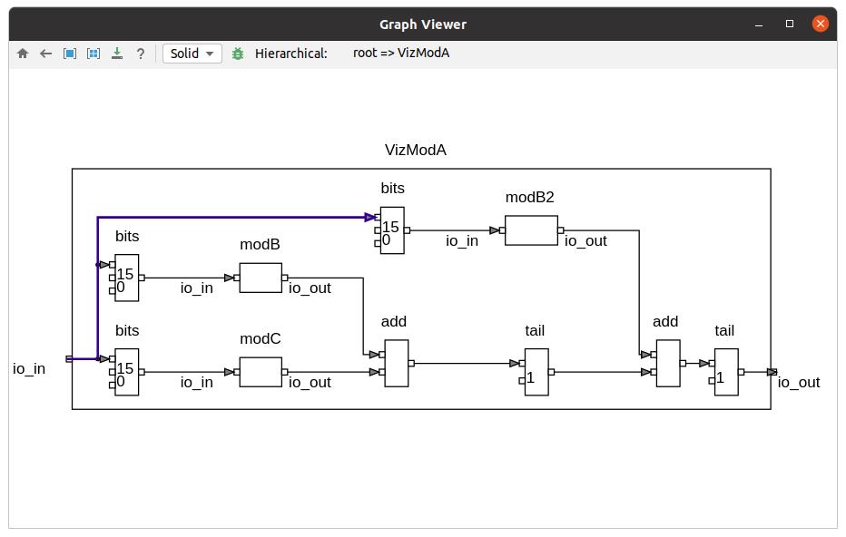

## EasySoC Diagrammer

This project can layout and diagram [ELK Graph](https://www.eclipse.org/elk/documentation/tooldevelopers/graphdatastructure.html) files emitted by  [layered-firrtl](https://github.com/easysoc/layered-firrtl) to visualize Chisel generated Firrtl circuits.

## Features

- Go to Top module
- Double-click go to submodule
- Go back
- Center selection, or if nothing is selected center the entire diagram
- Zoom selection to fill the entire canvas, or if nothing is selected zoom the entire diagram
- Export diagram to SVG
- Highlight selected elements

## Install

https://plugins.jetbrains.com/plugin/16255-easysoc-diagrammer

## FAQs

1. How to view the graph file

    After generating graph files by [layered-firrtl](https://github.com/easysoc/layered-firrtl), when you open a `.graph` file or right-click on it, menu 

    `HDL->Rendering the Graph Interactively` becomes available. 

    When opening the graph for the first time, some initialization work is required. After that, the rendering of the graph will be very fast.

2. How to view the exported SVG file

    The rendering effect of the diagram is mainly adapted to Chrome browser, other SVG viewers may see inconsistent effects. It is recommended to use Chrome browser and [SVG Navigator plugin](https://chrome.google.com/webstore/detail/svg-navigator/pefngfjmidahdaahgehodmfodhhhofkl) to see the SVG file.

